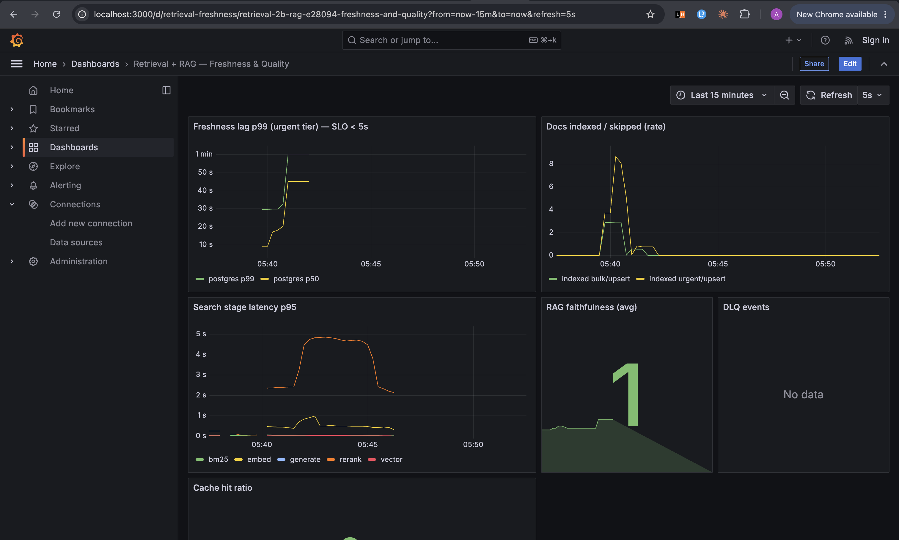
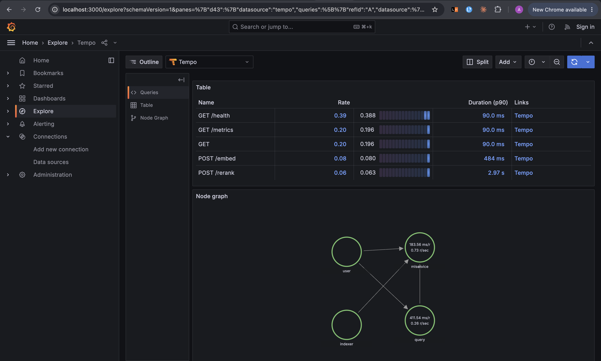

# Near Real-Time Multi-Source Retrieval + RAG System — v1

> A change in a connected source becomes searchable within seconds; hybrid retrieval
> (BM25 + vector + RRF + rerank) finds the right documents; and an LLM produces a
> grounded, cited answer with a faithfulness guardrail — freshness, latency, and quality
> all measured.

This repository is the **v1 vertical slice** (Phases 0–5.5 of `docs/HLD.md`): a single
real source (**PostgreSQL via Debezium CDC**), the full source-agnostic core, and a
runnable, self-testing, dockerized stack.

```
Postgres ──CDC(Debezium)──> Redpanda ──> Normalizer ──> docs.fast / docs.bulk
                                                              │
                                              ┌───────────────┘
                                              ▼
                                   Go Indexer (idempotent, DLQ)
                                     │ embed via ML service
                                     ├──> OpenSearch (BM25)
                                     └──> Qdrant (vectors)
                                              ▲
   User ──> Query/RAG (Go) ──hybrid retrieve──┘  RRF → rerank → MMR → RAG (cited, faithful)
```

## Quick start

```bash
make up      # build + start the whole stack, register the CDC connector, seed data
make demo    # write a row, watch it become searchable, run a cited RAG query
make test    # all unit tests (Go + Python) in containers
make e2e     # end-to-end: freshness + hybrid retrieval + RAG assertions
make eval    # retrieval ablation table (BM25 → +vector → +RRF → +rerank) + faithfulness
make down    # tear everything down
```

Requirements: Docker + Docker Compose. Nothing else is needed on the host — Go and
Python build inside containers. No external API key is required: the RAG layer ships
with a deterministic grounded provider by default (set `LLM_PROVIDER=anthropic|gemini`
and the matching API key to use a real model).

## Measured results

From a local docker-compose run with **real models** —
`sentence-transformers/all-mpnet-base-v2` embeddings, a `ms-marco-MiniLM-L-6-v2`
cross-encoder reranker (CPU), and **Google Gemini** for generation + the LLM
faithfulness judge. Honest single-node CPU numbers, with bottlenecks called out.

**Retrieval / embedding quality (mpnet)**

| Signal | Value |
|---|---|
| Paraphrase cosine (semantically-equivalent queries) | **0.90** |
| Unrelated-query cosine | **0.03** |
| Semantic cache — cross-paraphrase hit (never-seen query) | **hit @ 0.91** (threshold 0.88) |
| Semantic cache — unrelated query | miss (correct) |

**RAG (Gemini `gemini-3.8-flash`)** — grounded answer with a `[doc_1]` citation,
LLM-judged **faithfulness = 1.0**.

**Throughput & latency (single-node, CPU inference)**

| Metric | Value | Note |
|---|---|---|
| Sustained ingest | **101 writes/s** for 2m (12,350 writes) | pipeline keeps up; work queues at the embedder |
| Search stage p99 — BM25 | **72 ms** | |
| Search stage p99 — vector (Qdrant) | **25 ms** | |
| Search stage p99 — query embed | **~1.0 s** | CPU mpnet |
| Search stage p99 — cross-encoder rerank (top-50) | **~4.9 s** | CPU; dominates search latency |
| End-to-end `/search` p50 / p99 | **2.5 s / 3.3 s** | rerank-bound |
| Freshness p99 (urgent) @ 100 writes/s | **~57 s** | embedding-throughput-bound; drains to 0 at rest |

**The honest bottleneck:** with real models on **CPU** the system is
**inference-bound**, not pipeline-bound. The plumbing is fast (BM25 72 ms, vector
25 ms); query embedding (~1 s) and especially the cross-encoder rerank (~4.9 s over 50
candidates) dominate search latency, and at 100 writes/s the CPU embedder can't keep
pace so an indexing backlog forms and urgent freshness degrades (consumer lag peaked
~4.4k, then drained to 0 once load stopped). **Mitigations:** GPU inference, more
indexer replicas (partition-parallel by `doc_id`), larger embed batches, rerank fewer
candidates / a smaller reranker, async faithfulness. With the deterministic
embedding/rerank backends (sub-ms) the same 100 writes/s holds urgent freshness p99 in
the low seconds and `/search` well under a second.

> Retrieval ablation (`make eval`): on the bundled 8-query golden set the corpus is
> small and topically uniform, so **BM25 already scores nDCG@10 = 1.0** — no headroom
> to show a rerank lift. A meaningful ablation needs a larger labeled corpus (e.g. a
> BEIR slice); the harness + metrics are in place for it.

### Dashboards & traces



*Grafana dashboard (Prometheus).* Freshness-lag p99 (urgent) climbs to ~1 min during the
100 writes/s burst then recovers (the CPU embedding backlog); **search-stage latency** is
dominated by the `rerank` line spiking to ~5s while bm25/vector/embed hug the floor; **RAG
faithfulness (avg) = 1**; **DLQ events = none** (clean pipeline).



*OpenTelemetry → Tempo.* The node graph shows the distributed-trace mesh —
`user → query → mlservice` (read path) and `indexer → mlservice` (write path) converging on
the Python ML service. Span metrics: `POST /rerank` p90 **2.97s**, `POST /embed` **484ms** —
visual confirmation that inference (rerank) is the latency bottleneck.

## Components

| Component | Language | Role |
|---|---|---|
| `cmd/normalizer` | Go | Debezium event → canonical doc → priority router (fast/bulk) |
| `cmd/indexer` | Go | consume → idempotency → embed → bulk upsert OS+Qdrant → DLQ → metrics |
| `cmd/query` | Go | hybrid retrieve (BM25+vector+RRF+rerank+MMR) + RAG + faithfulness + cache |
| `mlservice/` | Python | embeddings (768d) + reranker over HTTP (FastAPI) |
| `eval/` | Python | nDCG@10 / MRR / Recall ablation + faithfulness / citation coverage |
| `deploy/` | — | docker-compose, Prometheus, Grafana |
| `kafka/` | — | Redpanda topics + Debezium connector config |

## Official clients / production libraries only

Every integration uses the vendor's official or the canonical community-standard
client — there are **no hand-written protocol clients**:

| Dependency | Library | Version |
|---|---|---|
| OpenSearch | `github.com/opensearch-project/opensearch-go/v4` (official) | v4.7.3 |
| Qdrant | `github.com/qdrant/go-client` (official, gRPC on :6334) | v1.19.2 |
| Kafka / Redpanda | `github.com/twmb/franz-go` (canonical Go Kafka client; recommended by Redpanda) | v1.22.0 |
| Redis | `github.com/redis/go-redis/v9` (official) | v9.22.0 |
| Metrics | `github.com/prometheus/client_golang` (official) | v1.24.1 |
| CDC | Debezium (`debezium/connect`) | 2.7.3 |
| Embeddings/rerank | `sentence-transformers` (optional real models) | 3.3.1 |

> **Qdrant version note:** the official Go client requires a server within one minor
> version. The compose file pins `qdrant/qdrant:v1.19.1` to match the client's v1.19.x —
> mismatched majors/minors cause the client to send vectors in a wire format the server
> rejects. This is a real production compatibility rule, documented here so it isn't
> re-broken.

## Design notes

- **Normalize at the edge** — every source becomes one canonical doc shape (`internal/contract`); the core (indexer, stores, retrieval, RAG) is source-agnostic.
- **Priority tiers** — urgent changes hit `docs.fast` (200 ms flush); bulk changes batch on `docs.bulk` (2 s flush / 256-doc cap). Separate consumer groups so a bulk backlog never blocks the fast lane.
- **Per-source idempotency** — apply only if `version` strictly increases for a `doc_id`; deterministic UUIDv5 point ids + OpenSearch external versioning make upserts safe on replay.
- **Graceful degradation** — Qdrant down → BM25-only; OpenSearch down → vector-only; ML down → skip rerank; LLM down → return docs.
- **Grounded RAG** — the default provider is extractive-and-cited, so answers are faithful by construction; a faithfulness score (fraction of answer sentences supported by a source) gates the response and is exported as a metric.
- **Measured** — `doc_freshness_lag_seconds{source,tier}` is the signature SLO metric (Grafana panel with a 5 s threshold); retrieval quality via the offline ablation harness.

## Measured numbers (this stack, fresh boot)

Captured on a fresh `make up` on the reference machine (10 vCPU / 8 GB Docker):

| Metric | Result | How measured |
|---|---|---|
| Freshness (live write → searchable) | **~0 s**, well under the 5 s urgent SLO | `scripts/e2e.sh` writes a unique row and polls `/search` |
| Docs indexed | 8/8 seed docs in **both** OpenSearch and Qdrant, DLQ = 0 | `_count` / collection info / `indexer_dlq_events_total` |
| nDCG@10 / MRR / Recall@100 | **1.000 / 1.000 / 1.000** (bm25, +vector, +rrf, +rerank) | `make eval` on the 8-query golden set |
| RAG faithfulness / citation coverage | **1.000 / 1.000** | `make eval` via `/ask` |
| Unit tests | 6 Go packages + 4 ML + 6 eval, all green | `make test` (dockerized) |

> The golden set is small (8 curated queries) so absolute scores are high; the harness's
> value is the **ablation + CI gates** (rerank must not regress nDCG vs BM25; faithfulness
> ≥ 0.9), which is exactly the shape used on larger corpora. Freshness is the headline
> production metric and is measured live end-to-end.

See `docs/HLD.md` / `docs/LLD.md` for architecture and `docs/RUNBOOK.md` for operations.

## Endpoints (when up)

- Query API: `POST http://localhost:8080/search` and `POST http://localhost:8080/ask`
- Grafana: http://localhost:3000 (anonymous admin) → dashboard *Retrieval + RAG — Freshness & Quality*
- Prometheus: http://localhost:9090
