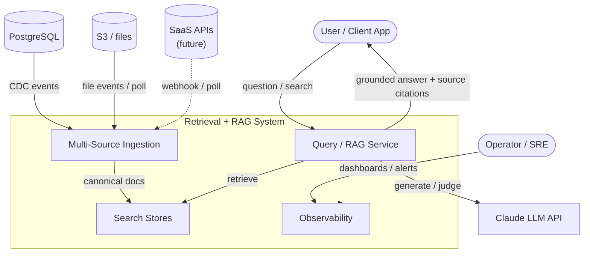
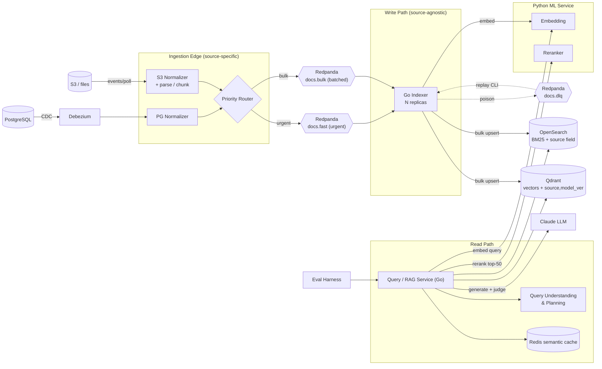
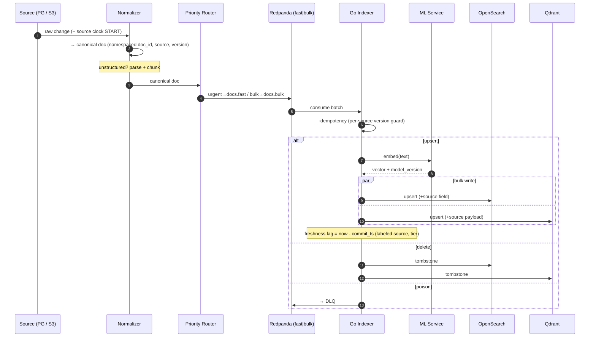
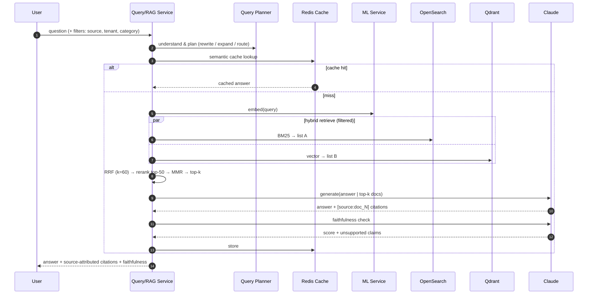
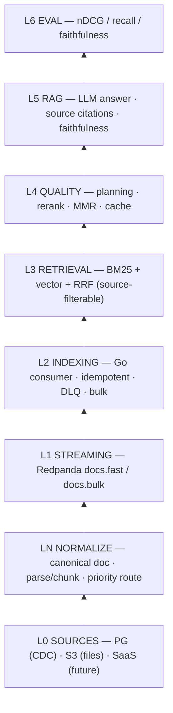
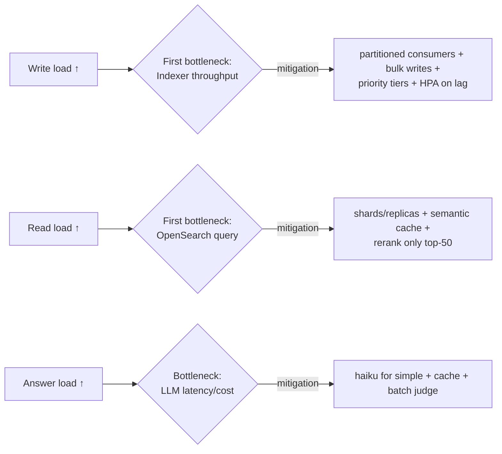
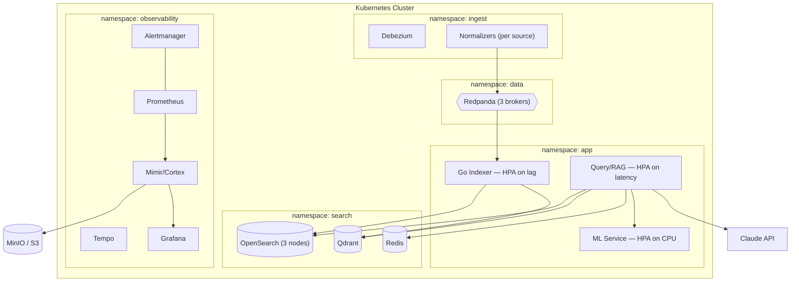

# High-Level Design (HLD) — Near Real-Time Multi-Source Retrieval + RAG System

> A system where a change in any connected source (a DB row, a file, a SaaS record)
> becomes searchable within seconds, hybrid retrieval finds the right documents across
> all sources, and an LLM produces a grounded, cited answer — with freshness, latency,
> and quality all measured per source.

**Revision 2** — adds multi-source ingestion, priority-tiered freshness, and prior-art
alignment (DoorDash in-house search). See §12 for the change log.

---

## 1. Goals & Non-Goals

### Goals
- **Multi-source ingestion** — pull changes from many heterogeneous sources (DB via CDC, files, SaaS APIs) into one searchable corpus.
- **Near real-time indexing** — an urgent change is queryable in seconds (measured as an SLO, per source).
- **Priority-tiered freshness** — urgent changes indexed immediately; bulk/low-urgency changes batched (cost + honesty).
- **Hybrid retrieval** — lexical (BM25) + semantic (vector) via RRF, then rerank, across all sources.
- **Grounded generation (RAG / Level 2)** — LLM answers strictly from retrieved docs, with inline **source-attributed** citations and a faithfulness guardrail.
- **Production-grade reliability** — idempotency, DLQ + replay, zero-downtime reindex, backpressure.
- **Measured quality** — retrieval (nDCG@10, Recall) and answer (faithfulness, citation accuracy).

### Non-Goals (v1)
- Agentic / multi-step tool-using retrieval (Level 3) — deferred to v2.
- Segment-replication index distribution (DoorDash-style build-once/pull-from-S3) — noted as future work (§11), scoped out.
- Multi-region / active-active HA.
- Full multi-tenant SaaS billing/quota (tenant isolation is designed, not productized).

---

## 2. Key Design Decisions

| Area | Choice | Rationale |
|---|---|---|
| Ingestion shape | **Normalizer at the edge** → canonical doc | One source-specific module per source; everything downstream is source-agnostic. |
| Sources (v1) | **PostgreSQL (CDC)** + **S3 files** | Contrasting pair: structured/real-time vs unstructured/poll — proves the pattern. |
| Freshness model | **Priority tiers** (fast lane + bulk lane) | Not all changes are equally urgent; borrowed from DoorDash. |
| CDC | Debezium | Mature Postgres WAL streaming. |
| Broker | **Redpanda** | Kafka API, no JVM/ZooKeeper, simpler ops, Prometheus-native. |
| Indexer | **Go, N replicas** | Throughput on the write path (fixes the known consumer bottleneck). |
| Lexical store | OpenSearch | BM25 + mature ops (Lucene under the hood). |
| Vector store | Qdrant | Fast ANN, metadata filtering, payload support. |
| Fusion | RRF (k=60) | No score normalization, robust, cheap. |
| Rerank / embeddings | **Python ML service** | Model ecosystem lives in Python; called over gRPC/HTTP. |
| Generation | Claude (`claude-opus-4-8` quality / `claude-haiku-4-5` cheap) | Grounded answers + faithfulness judging. |
| Observability | Prometheus → Mimir/Cortex → MinIO, OTel → Tempo, Grafana | Scalable, multi-tenant metrics; end-to-end traces. |

**Principles:**
- Normalize at the edge → the core (indexer, stores, retrieval, RAG) never learns there are multiple sources.
- Go owns the write path (throughput); Python owns the ML path (models); typed RPC boundary between them.
- **Separate read and write paths** — validated by DoorDash (isolating searchers from indexing traffic is why their p99.9 dropped 50%).

---

## 3. System Context (C4 Level 1)



---

## 4. Container / Component View (C4 Level 2)



---

## 5. The Two Critical Paths

### 5.1 Write Path — "change → searchable" (multi-source, tiered)



### 5.2 Read Path — "question → grounded answer"



---

## 6. Canonical Document (the multi-source contract)

Every source normalizes to one shape before Redpanda. **This is the trick that keeps the core source-agnostic.**

```json
{
  "source": "postgres",
  "source_id": "documents:42",
  "doc_id": "postgres:documents:42",
  "tenant_id": 7,
  "op": "upsert",
  "tier": "urgent",
  "version": 3,
  "commit_ts": "2026-09-15T10:00:00Z",
  "title": "...",
  "body": "...",
  "metadata": { "category": "infra", "url": "...", "author": "..." }
}
```

- `doc_id` is namespaced (`{source}:{native_id}`) — no cross-source collisions.
- `version` is **per-source monotonic** (LSN / resume token / ETag / `updated_at`).
- `tier` decides fast vs bulk lane.
- `commit_ts` is the per-source freshness clock.

---

## 7. Data Flow Layers



---

## 8. Non-Functional Requirements (targets)

| NFR | Target | How measured |
|---|---|---|
| Freshness lag (urgent tier) | p99 < 5s @ 100 QPS writes | commit_ts → visible histogram, labeled source+tier |
| Freshness lag (bulk tier) | best-effort, tracked | same, bulk lane |
| Consumer lag | seconds (not minutes) @ 100 QPS | Redpanda consumer group lag |
| Search latency | hybrid+rerank p99 < ~2s | OTel span timing |
| Retrieval quality | nDCG@10 improves with rerank | offline eval |
| Answer quality | faithfulness > 0.9 | LLM/NLI judge |
| Availability | degrade gracefully (BM25-only if vector down) | chaos tests |
| Reindex | zero query downtime | alias-swap test |

---

## 9. Capacity & Bottlenecks (expected)



---

## 10. Deployment Topology (production)



---

## 11. Prior Art & Future Work

### Prior art alignment (DoorDash in-house search, 2024)
DoorDash rebuilt search on Apache Lucene with three services and reported **50% lower p99.9 latency, 75% lower hardware cost**. Lessons adopted here:

| DoorDash idea | How we apply it |
|---|---|
| Indexer / Searcher / Broker split | Separate indexer / query-service (read-write isolation) ✅ |
| Dual-tier indexing (immediate vs 6h bulk) | **Priority tiers** (docs.fast / docs.bulk) — *interval tuned to our freshness SLO, not 6h* |
| Broker Query Understanding & Planning | Query Understanding & Planning stage in read path |
| Segment replication (build once, replicas pull from S3) | **Future work** — cost optimization, scoped out of v1 |

**Where we differ:** DoorDash's public design is lexical/Lucene + ranking over a catalog. Ours adds **semantic vectors + RAG** and targets **near-real-time freshness** (we don't batch on a 6h cycle for urgent data). Newer generation, different tradeoff.

### Future work
- Segment-replication index distribution (build-once / replicas pull immutable segments from S3).
- Additional sources: MongoDB (change streams), SaaS (Zendesk/Jira/Notion webhooks), external Kafka mirror.
- Cross-source near-duplicate collapse.
- Level 3 agentic retrieval (MCP server, adaptive retrieve→judge→re-retrieve loop).

---

## 12. Roadmap & Change Log

### Roadmap

| Phase | Deliverable | Milestone |
|---|---|---|
| 0 | Scaffold + compose | `make up` healthy |
| 1 | CDC → Redpanda + **normalizer + canonical doc + priority router** | event visible ms after write |
| 2 | Go indexer (idempotent per-source, DLQ, bulk) | chaos + idempotency tests pass |
| 3 | Hybrid retrieval + RRF (source-filterable) | fused results |
| 4 | Query planning + rerank + MMR + cache | latency logged |
| 5 | Eval harness | nDCG ablation table |
| 5.5 | RAG (Level 2) + source-attributed citations | cited answers + faithfulness |
| 6 | Zero-downtime reindex | live model swap |
| 7 | Freshness SLO (per source+tier) + observability | dashboards + alerts |
| 8 | Helm + HPA + load test | autoscale demo @100 QPS |
| v2 | S3 source + parse/chunk, more sources, segment replication | — |

**v1 cut = Phases 0–5.5** (≈3 weekends). Ship before starting v2.

### Change log
- **Rev 2:** multi-source ingestion (normalizer + canonical doc), priority-tiered freshness (fast/bulk lanes), `source` field + provenance in citations, per-source+tier freshness metric, formalized Query Understanding & Planning stage, DoorDash prior-art + future-work sections.
- **Rev 1:** initial single-source (Postgres) retrieval + RAG design.

See `LLD.md` for component internals, schemas, and algorithms.
