# Low-Level Design (LLD) — Near Real-Time Multi-Source Retrieval + RAG System

> Component internals, data schemas, algorithms, and failure handling.
> Companion to `HLD.md`. **Rev 2** — multi-source normalizers, canonical doc,
> priority-tiered ingestion, per-source versioning & freshness.

---

## 1. Repository Layout

```
search-and-retrieval-system/
├── sources/            # NEW: source-specific connectors + normalizers
│   ├── postgres/       # Debezium CDC → canonical doc
│   ├── s3/             # file events/poll → parse + chunk → canonical doc
│   ├── normalizer/     # shared canonical-doc builder + priority router
│   └── contract/       # canonical doc schema (proto/json)
├── indexer/            # Go: Redpanda consumer → OpenSearch + Qdrant (source-agnostic)
│   ├── cmd/indexer/
│   ├── internal/consumer/     # batch, offset mgmt, backpressure, fast/bulk lanes
│   ├── internal/sink/         # opensearch + qdrant bulk writers
│   ├── internal/idempotency/  # per-source version guard
│   ├── internal/dlq/          # dead-letter + replay
│   └── internal/metrics/      # prometheus + freshness lag (labeled source,tier)
├── mlservice/          # Python: embeddings + reranker (gRPC/HTTP)
├── query/              # Go: query planning + hybrid retrieval + RRF + RAG
│   ├── internal/plan/         # query understanding & planning (Broker-style)
│   ├── internal/retrieve/     # bm25, vector, rrf, mmr (source filters)
│   ├── internal/rag/          # prompt, generate, faithfulness, cite(source)
│   └── internal/cache/        # semantic cache
├── eval/               # Python: nDCG/MRR/recall + faithfulness eval
├── kafka/              # Redpanda + Debezium connector config + compose
├── deploy/             # docker-compose + Helm + observability stack
└── docs/               # HLD.md, LLD.md
```

---

## 2. Data Model

### 2.1 Canonical document (the multi-source contract)

Emitted by every normalizer to Redpanda. Downstream code only ever sees this.

```json
{
  "source": "postgres",
  "source_id": "documents:42",
  "doc_id": "postgres:documents:42",
  "tenant_id": 7,
  "op": "upsert",
  "tier": "urgent",
  "version": 3,
  "commit_ts": "2026-09-15T10:00:00Z",
  "title": "...",
  "body": "...",
  "chunk_id": 0,
  "metadata": { "category": "infra", "url": "...", "author": "..." }
}
```

| Field | Meaning |
|---|---|
| `source` | provenance; also a filterable facet |
| `doc_id` | globally unique = `{source}:{native_id}[:chunk]` |
| `version` | **per-source** monotonic (LSN / resume token / ETag / updated_at) |
| `tier` | `urgent` → docs.fast, `bulk` → docs.bulk |
| `commit_ts` | per-source freshness clock start |
| `chunk_id` | for unstructured sources split into chunks |

### 2.2 Source table (PostgreSQL)

```sql
CREATE TABLE documents (
    id         BIGSERIAL PRIMARY KEY,
    tenant_id  BIGINT NOT NULL,
    title      TEXT NOT NULL,
    body       TEXT NOT NULL,
    category   TEXT,
    updated_at TIMESTAMPTZ NOT NULL DEFAULT now(),
    version    BIGINT NOT NULL DEFAULT 1
);
CREATE PUBLICATION retrieval_pub FOR TABLE documents;
```

### 2.3 Per-source change mechanism & versioning

| Source | Change mechanism | `version` source | `tier` rule |
|---|---|---|---|
| PostgreSQL | Debezium (WAL) | LSN | stock/price/delete → urgent; else bulk |
| S3 / files | bucket event → SQS, or poll | object version / ETag | new/changed file → bulk (parse cost); deletes → urgent |
| MongoDB (v2) | change stream | resume token | app-defined |
| SaaS API (v2) | webhook / poll `updated_since` | `updated_at` | webhook → urgent; poll → bulk |

### 2.4 OpenSearch mapping (lexical)

```json
{
  "mappings": { "properties": {
    "doc_id":    { "type": "keyword" },
    "source":    { "type": "keyword" },
    "tenant_id": { "type": "keyword" },
    "title":     { "type": "text" },
    "body":      { "type": "text" },
    "category":  { "type": "keyword" },
    "version":   { "type": "long" },
    "commit_ts": { "type": "date" }
  }}
}
```

### 2.5 Qdrant collection (semantic)

```
collection: documents
vector: { size: 768, distance: Cosine }
payload: { doc_id, source, tenant_id, category, version, model_version, commit_ts }
```

### 2.6 Entity relationships

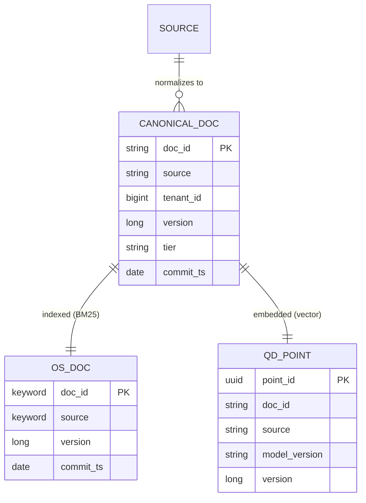

---

## 3. Normalizer & Priority Router (NEW)

The **only** source-specific code. Turns raw source changes into canonical docs and routes by urgency.

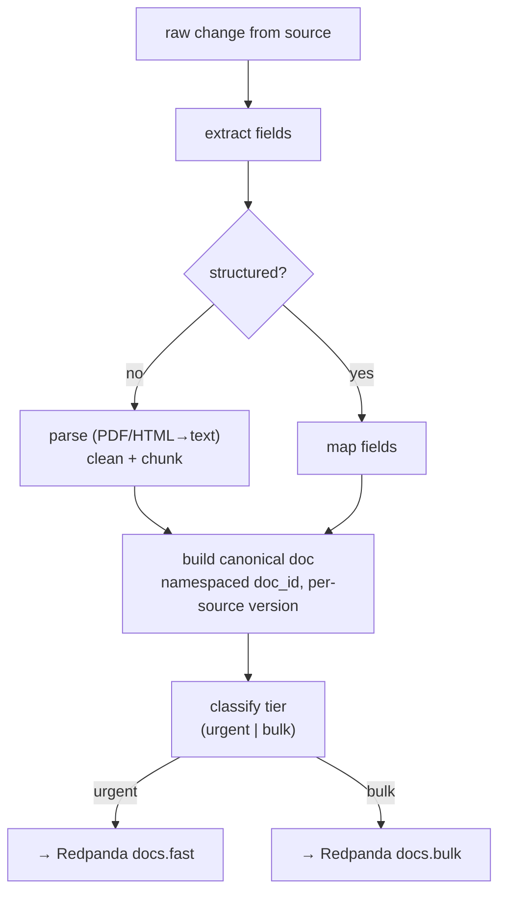

- Chunking (unstructured): each chunk → separate canonical doc with `chunk_id`, sharing parent `doc_id` prefix.
- Tier classification is a small rule set per source (see §2.3).

---

## 4. Go Indexer — Internals

### 4.1 Processing pipeline (dual-lane)

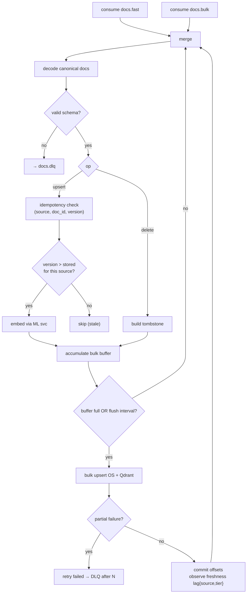

> Fast lane gets a smaller flush interval (low latency); bulk lane uses larger batches (throughput). Both feed the same idempotent sink.

### 4.2 Per-source idempotency guard

**Rule:** apply only if `version` is strictly greater than what's stored **for that source**. Versions are not comparable across sources.

```go
func shouldApply(in CanonicalDoc, stored StoredMeta) bool {
    // stored keyed by doc_id (already source-namespaced)
    return in.Version > stored.Version
}
// Qdrant point_id = UUIDv5(namespace, doc_id) → upsert overwrites
// OpenSearch _id = doc_id, version_type=external, version=in.Version
```

### 4.3 Delivery & ordering guarantees

| Concern | Mechanism |
|---|---|
| Per-doc ordering | Redpanda key = `doc_id` → same partition |
| At-least-once | commit offsets only after successful bulk write |
| Idempotent apply | per-source version guard + deterministic IDs |
| Poison events | DLQ topic after N retries |
| Backpressure | bounded channel; pause fetch when sinks slow |
| Tier isolation | separate topics; fast lane not blocked by bulk backlog |

---

## 5. Dead-Letter Queue & Replay

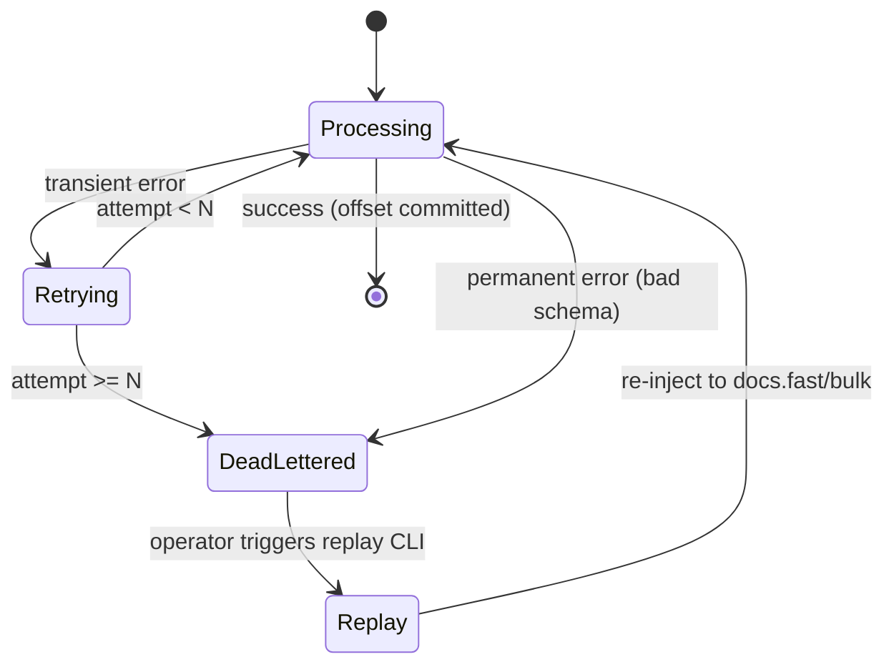

DLQ record: original canonical doc, `source`, error, retry count, first-seen ts, source offset. Replay CLI can filter by `source` or error type.

---

## 6. Retrieval Layer

### 6.1 Hybrid search flow (source-filterable)

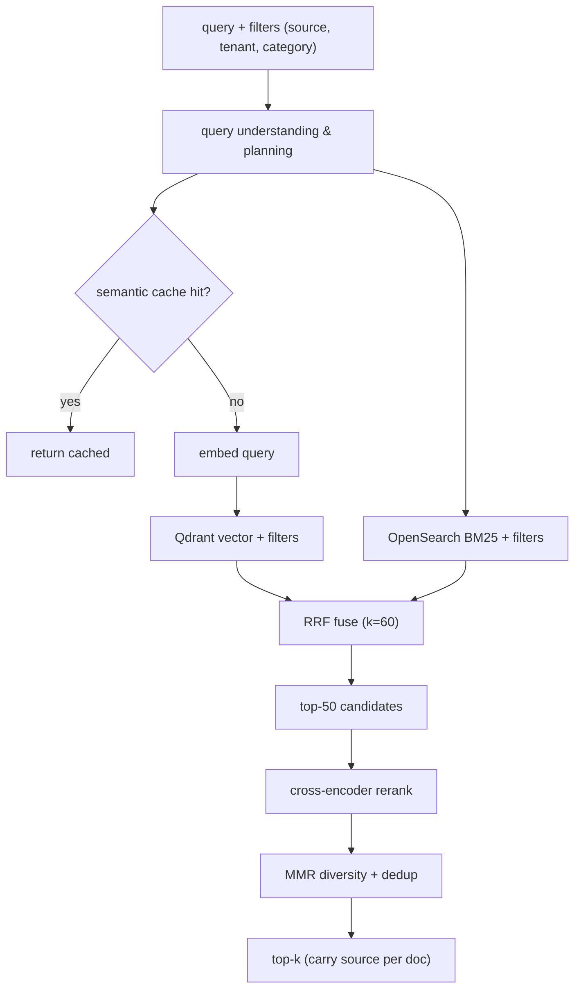

### 6.2 RRF algorithm

```go
func rrf(lists [][]DocID, k int) []Scored {
    score := map[DocID]float64{}
    for _, list := range lists {
        for rank, id := range list {
            score[id] += 1.0 / float64(k+rank+1)
        }
    }
    return sortDescByScore(score)
}
```

### 6.3 Filtering & query planning

- Filters (`source`, `tenant_id`, `category`, date) pushed **into both** OpenSearch and Qdrant queries (never post-filtered) — preserves recall + tenant/source isolation.
- **Query Understanding & Planning** (Broker-style) runs first: rewrite/expand, extract filters from NL (`"in confluence"` → `source=confluence`), optional HyDE, route simple vs complex.

---

## 7. RAG Layer (Level 2)

### 7.1 Answer generation flow

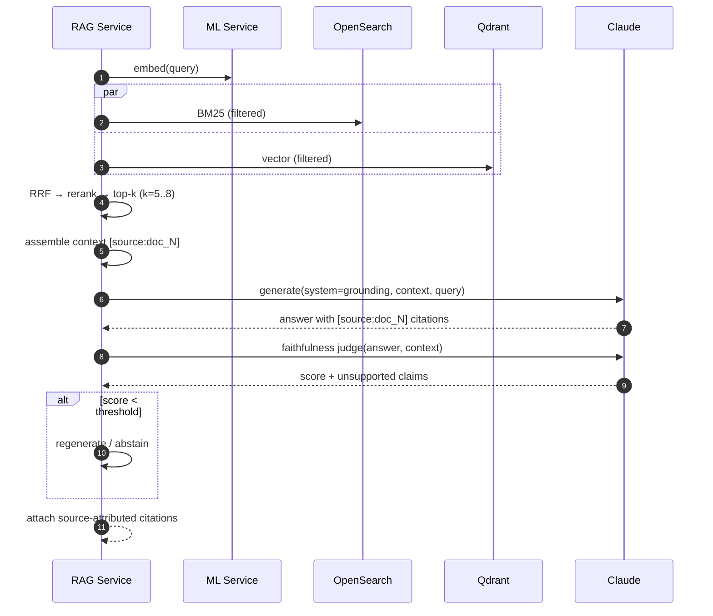

### 7.2 Grounding prompt (contract)

```
SYSTEM:
Answer ONLY using the numbered sources. Cite each claim as [doc_N].
If the sources do not contain the answer, reply "Not found in sources."
Do not use outside knowledge. Do not guess.

USER:
Sources:
[doc_1] (source=postgres) {chunk_1}
[doc_2] (source=confluence) {chunk_2}
Question: {query}
```

Model routing: `claude-haiku-4-5` simple, `claude-opus-4-8` complex synthesis.

### 7.3 Faithfulness check

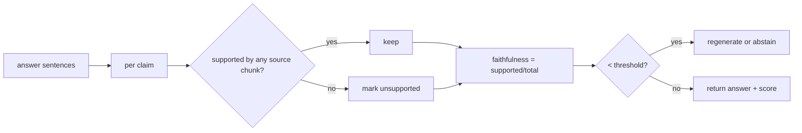

### 7.4 Response schema (source-attributed)

```json
{
  "answer": "Debezium reads the WAL [doc_1] and Redpanda buffers it [doc_2].",
  "citations": [
    { "marker": "doc_1", "doc_id": "postgres:documents:42", "source": "postgres", "score": 0.91 },
    { "marker": "doc_2", "doc_id": "confluence:page:88", "source": "confluence", "score": 0.87 }
  ],
  "faithfulness": 1.0,
  "latency_ms": 240,
  "model": "claude-opus-4-8"
}
```

---

## 8. ML Service (Python) — Interface

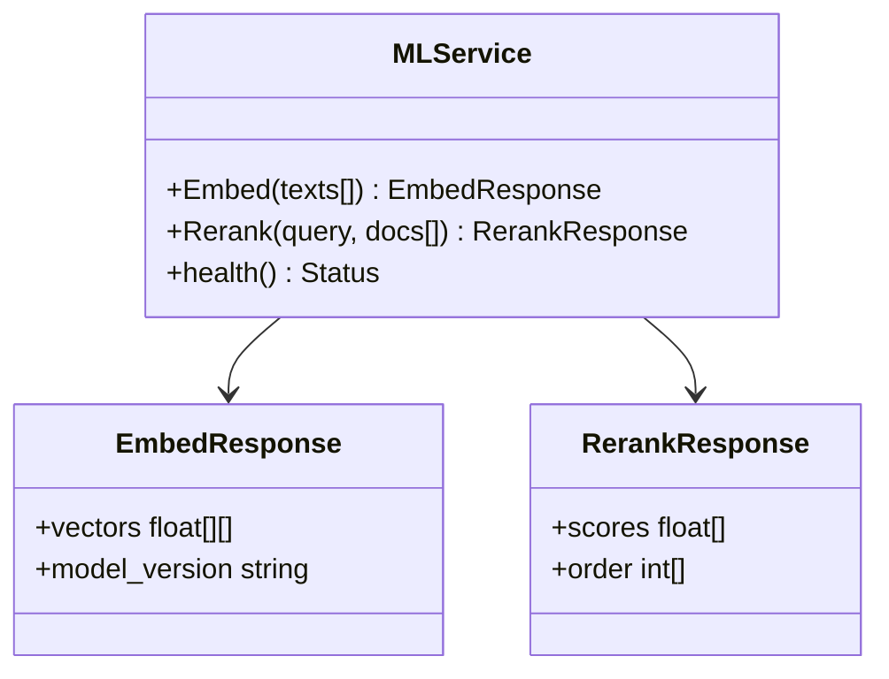

Stateless; HPA on CPU/GPU. `model_version` written to Qdrant payload → enables reindex cutover. Batched inference.

---

## 9. Zero-Downtime Reindex (alias swap)

```mermaid
sequenceDiagram
    autonumber
    participant OP as Operator
    participant IDX as Indexer
    participant OS as OpenSearch
    participant QD as Qdrant

    OP->>OS: create documents_v2 (new mapping)
    OP->>QD: create documents_v2 (new model dim)
    OP->>IDX: backfill from all sources → v2 (new model_version)
    IDX->>IDX: dual-write live docs to v1 + v2
    OP->>OS: move alias "documents" → v2 (atomic)
    OP->>QD: switch query collection → v2
    Note over OP: queries never stop; v1 retired after soak
```

---

## 10. Observability — Signals

### 10.1 Freshness lag (signature metric, per source & tier)

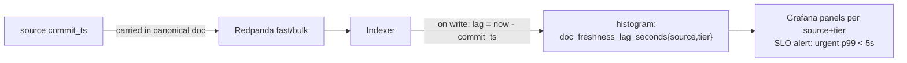

### 10.2 Metric catalog

| Metric | Type | Labels | Source |
|---|---|---|---|
| `doc_freshness_lag_seconds` | histogram | source, tier | indexer |
| `indexer_bulk_write_seconds` | histogram | sink | indexer |
| `indexer_dlq_events_total` | counter | source, reason | indexer |
| consumer group lag | gauge | topic | Redpanda |
| `rag_faithfulness_score` | histogram | — | query svc |
| `search_stage_latency_seconds` | histogram | stage | query svc |
| `cache_hits_total / misses_total` | counter | — | query svc |

### 10.3 Collection topology

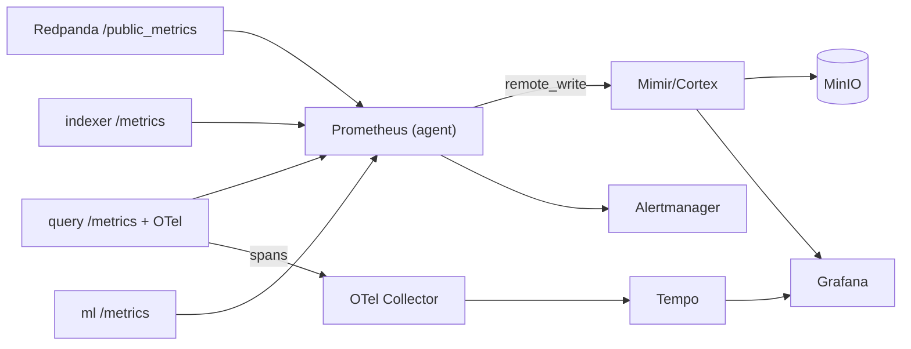

---

## 11. Evaluation Harness

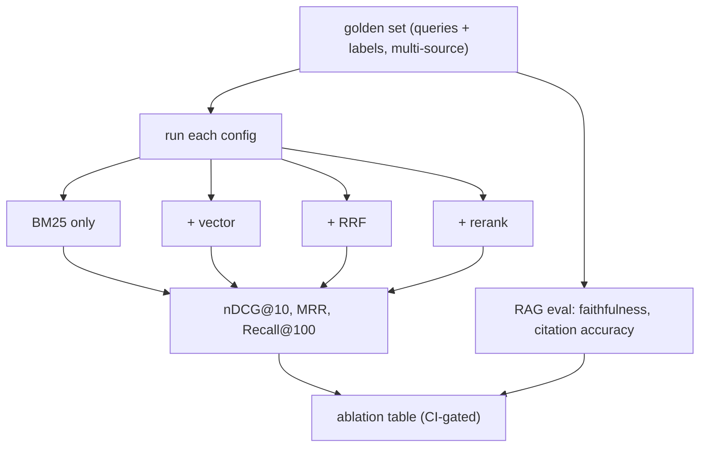

---

## 12. Failure Modes & Degradation

| Failure | Behavior |
|---|---|
| Qdrant down | BM25-only (degraded, flagged) |
| OpenSearch down | vector-only |
| ML service down | skip rerank, return RRF order |
| LLM down/timeout | return retrieved docs, no generated answer |
| Faithfulness < threshold | abstain or regenerate |
| Indexer crash | resume from committed offset, idempotent |
| Poison event | DLQ + alert, pipeline continues |
| One source connector down | other sources keep flowing (isolated normalizers) |
| Bulk backlog | fast lane unaffected (separate topic) |

---

## 13. Configuration (env)

```
# Redpanda
REDPANDA_BROKERS, FAST_TOPIC=docs.fast, BULK_TOPIC=docs.bulk, DLQ_TOPIC=docs.dlq, CONSUMER_GROUP
# Sources
PG_DSN, PG_PUBLICATION=retrieval_pub
S3_BUCKET, S3_POLL_INTERVAL, S3_EVENT_QUEUE
# Indexer
FAST_FLUSH_MS=200, BULK_FLUSH_MS=2000, BATCH_SIZE, MAX_IN_FLIGHT, BULK_RETRIES
# Stores
OPENSEARCH_URL, QDRANT_URL, REDIS_URL
# ML
ML_SERVICE_ADDR, EMBED_MODEL, RERANK_MODEL
# RAG
LLM_MODEL_FAST=claude-haiku-4-5, LLM_MODEL_QUALITY=claude-opus-4-8
FAITHFULNESS_THRESHOLD=0.9, RAG_TOP_K=6, RERANK_TOP_N=50, RRF_K=60
```

See `HLD.md` for architecture, NFRs, prior art, and roadmap.
